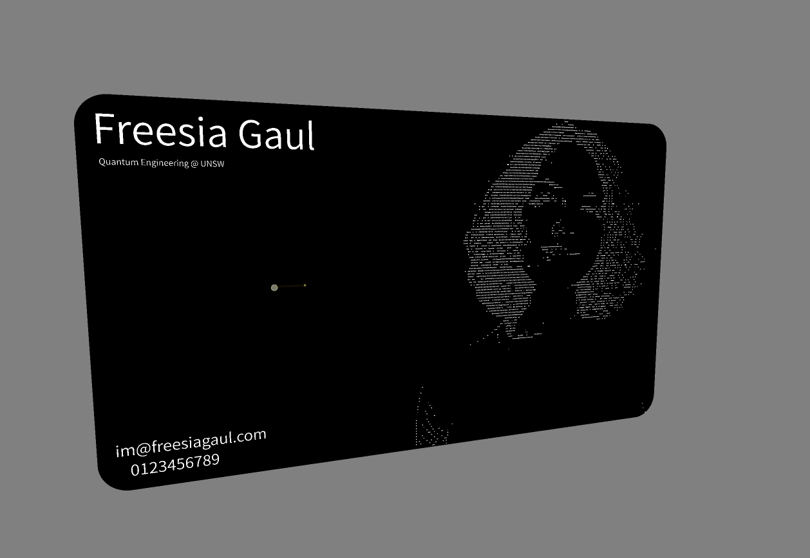
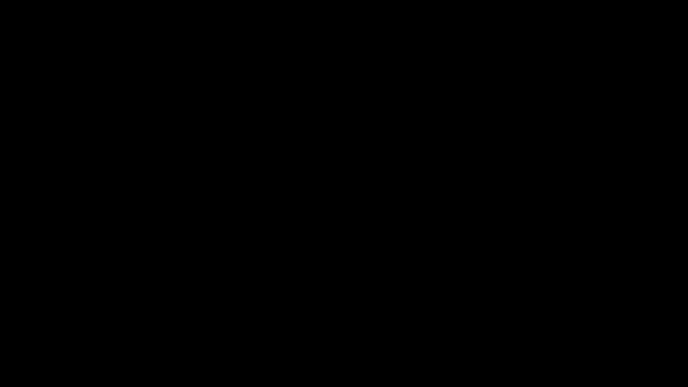

<h1>ASCII Site: Neocities </h1>

Geocities-ASCII Themed Site  
(Because I can.)

<a href="https://freesia.neocities.org">[My Corner of the Web]</a>

<h2>Why?</h2>

This whole thing started when I did HackClub and made a small NFC-based PCB business card. I didn't know what to add, so I put an ASCII art image of myself on it. (Fig. 1)

But then it occured to me, I didn't actually know what I wanted to write to the card. So I decided to follow the cards theme and make an old-style site based on GeoCities, and found <a href="https://github.com/neocities/neocities"> Neocities </a> in the process, an awesome community continuing the tradition of free web hosting. (If you're wondering, yes! It is so ancient it actually only lets you use HTML/CSS/JS. 🤣)
   
Making little easter eggs and animations is just charming, and frankly feels like art, so this is super fun! :)
 
If you like clacking on your computer and you're bored, you should try it too!

<h2>Why not?</h2>

<h2>Credits</h2>

This theme was inspired by:

<ul>
  <li> <a href=https://github.com/schnensch0/zelk> Neocities </li>
  <li> <a href=https://momg.neocities.org/?n=Maureen-Owens&p=43964f5i14427f4i11565f1i46214f1i759f3i65923f2i42545f2i40347f4i41160f4i10975f2i84085f2i290f1i86255f2i64719f2i22150f5i86137f4> These Sick Gifs </li>
</ul>
