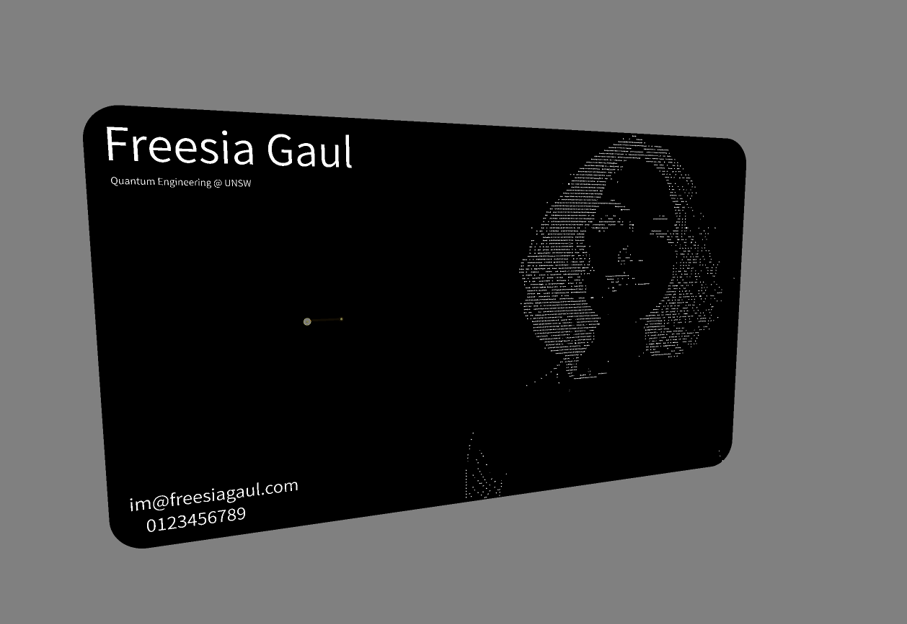

# NFC Card

## What is this?

This is a PCB that uses an [NT3H2111W0FHKH](data_sheet_NT3H2111_2211-2303598.pdf) for read/write purposes. I learned how to make this relatively simple circuit when I was apart of HackClub. I wrote my website onto the card such that phones can scan it and it takes them there. These chips are awesome because they're cheap and induce their own power when scanned.
 
 
It's essentially a fancy "business" card.

## 3D Image

## Schematic

